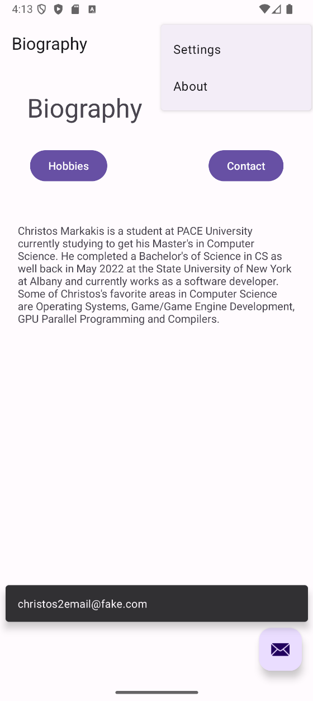
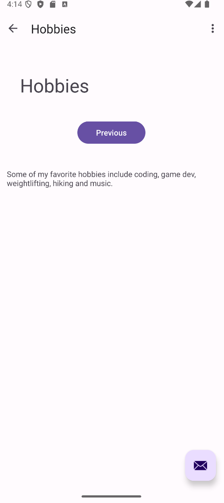

# About Me Homework 1

## <ins>About</ins>

 This is an introductory assignment for Android app development using Android Studio for CS639.

 Features an about me app with 3 fragments, Biography, Hobbies and Contact.

## <ins>Screenshots</ins>

